# Akıllı Şaraphane Yönetim Sistemi

Bağdan gelen üzümün kabulünden şarabın fermantasyonuna, laboratuvar kontrollerinden
fıçılamaya, şişelemeden stok ve sevkiyata kadar tüm süreci yöneten, **Windows üzerinde
çalışan, Türkçe ve İngilizce arayüzlü** üretime hazır bir üretim yönetim sistemi.

Sistem üç farklı yapay zekâ sağlayıcısını (yerel **LM Studio**, **Claude**, **NVIDIA Build**)
ortak bir soyutlama katmanı üzerinden kullanır; hassas veriler öncelikle **yerel modelle**
işlenir ve dış servise veri gönderilmeden önce kullanıcı onayı istenir.

---

## Bu yazılım ne yapar, ne YAPMAZ

**Yapar.** Bağ ve üzüm kabulünden fermantasyona, laboratuvar kontrolerinden fıçılamaya,
şişelemeden stok ve sevkiyata kadar bir şaraphanenin üretim zincirini kayıt altına alır;
parti izlenebilirliği, maliyet dağılımı, kalite spesifikasyon denetimi, bakım planlaması ve
değiştirilemez bir denetim günlüğü tutar. Sekiz sayısal analiz (fermantasyon bitiş tahmini,
anomali tespiti, kalite puanı, risk değerlendirmesi, kupaj öngörüsü, stok tükenme tahmini,
bakım tarihi, rapor özeti) **dil modelinden bağımsız** çalışır.

**YAPMAZ.**

- **Muhasebe / ERP / e-fatura değildir.** Maliyet hesabı yönetim raporlaması içindir;
  resmî mali beyan, vergi hesabı veya yasal defter yerine geçmez.
- **Yasal uyum belgesi üretmez.** Türk Gıda Kodeksi, TAPDK/ATO, AB şarap mevzuatı veya
  ihracat sertifikasyonu için gereken beyanları **doğrulamaz ve üretmez**. Kayıtların
  mevzuata uygunluğu işletmenin sorumluluğundadır.
- **Sağlık, gıda güvenliği veya alerjen beyanı üretmez.** Laboratuvar değerleri
  operatörün girdiği verilerdir; sistem bunları tıbbî veya gıda güvenliği kararı olarak
  yorumlamaz.
- **Yatırım, fiyatlama veya ticari tavsiye vermez.**
- **Üretim değerlerini kendiliğinden değiştirmez.** Yapay zekâ çıktıları **karar
  desteğidir**; hiçbir öneri kullanıcı onayı olmadan bir tanka, reçeteye veya stok
  hareketine uygulanmaz. İnsan onayı mimarının zorunlu adımıdır.
- **Sensör/SCADA entegrasyonu içermez.** Fermantasyon ölçümleri elle veya API ile
  girilir; hazır bir donanım sürücüsü yoktur.
- **Çok kiracılı (multi-tenant) SaaS değildir.** Tek işletme, tek kurulum için
  tasarlanmıştır.

## Olgunluk

**Durum: çalışan, test edilmiş, üretimde denenmemiş.** Kod tabanlı 536 otomatik testle
doğrulanır ve tam bir kurulum/başlatma zinciri vardır; ancak gerçek bir şaraphanede
canlı kullanıma alınmamıştır. Bir değerlendirme ve referans uygulama olarak okuyun,
hazır bir ticari ürün olarak değil. Bilinen eksikler:
[docs/known-limitations.md](docs/known-limitations.md).

## Demo verisi tamamen kurgusaldır

`scripts\demo-veri.ps1` ile yüklenen bütün bağ, tedarikçi, müşteri, personel ve parti
kayıtları **uydurmadır**. Gerçek bir kişi, işletme, adres, telefon numarası veya
ticari veri içermez ve içermemelidir. Demo hesaplarının parolaları yalnızca
geliştirme içindir ve ilk girişte değiştirilmeleri **zorunlu tutulur**.
Üretim kurulumunda `SEED_DEMO_DATA=false` yapın ve demo hesaplarını silin.

## İlk giriş ve yönetici hesabı

Yeni bir kurulumda uygulama tek kullanımlık `admin` / `admin` yönetici hesabını
oluşturur. Bu kimlik yalnızca ana bilgisayardan ilk giriş için kullanılabilir ve
hemen güçlü, yeni bir parolayla değiştirilmelidir.

Bu hesap için geçerli kurallar:

| Kural | Nerede uygulanır |
|---|---|
| Parola değiştirilmeden **hiçbir** korumalı uç nokta açılmaz (pano, üretim, müşteri/personel, mali kayıt, AI ayarları, dışa aktarma, yedekleme) | `backend/app/core/deps.py` |
| Parola değiştirilene kadar **yalnızca yerel makineden** (localhost) giriş yapılabilir; ağ üzerinden reddedilir | `backend/app/api/v1/auth.py` |
| Değiştirildikten sonra eski parola **kalıcı olarak** geçersizdir ve `ILK-GIRIS.txt` silinir | `backend/app/api/v1/auth.py` |
| Yönetici parola sıfırlaması kurulum durumunu **geri getirmez** | `backend/app/api/v1/users.py` |
| Parola Argon2id ile karmalanır; günlük, hata mesajı, yedek ve telemetride **hiçbir zaman** yer almaz | `backend/app/core/security.py` |
| 5 hatalı denemede hesap kilidi + hız sınırlama | `backend/app/core/ratelimit.py` |

Bu kuralların tamamı `tests/test_kurulum_hesabi_kisitlari.py` içinde regresyon
testleriyle doğrulanır.

## API anahtarları

Bu depoda **hiçbir gerçek API anahtarı yoktur** — kaynakta, geçmişte, `.env.example`
içinde, testlerde, ekran görüntülerinde veya günlüklerde. `.env.example` yalnızca **boş**
değerler içerir.

Anahtarı kurulumdan sonra siz verirsiniz (ortam değişkeni, `.env` veya uygulama içi
**Ayarlar** ekranı). Ekrandan girilen anahtar Fernet ile şifrelenerek veritabanında
saklanır. Anahtar yoksa ilgili sağlayıcı **NOT_CONFIGURED** durumunda görünür ve
**hiçbir istek atmaz**; yerel model (LM Studio) ve yapay zekâ gerektirmeyen tüm
özellikler çalışmaya devam eder. Arayüzde yalnızca sağlayıcı adı, durum ve
anahtarın **son 4 karakteri** gösterilir. "Bağlantıyı test et" yalnızca açık kullanıcı
eylemiyle çalışır ve anahtar hiçbir yere yazılmaz.

## Gizlilik ve insan onayı sınırları

- Varsayılan sağlayıcı **yereldir** (LM Studio); veri makineden çıkmaz.
- Harici (bulut) bir sağlayıcı seçildiğinde onay kapısı **her istekte ve koşulsuz**
  çalışır; gönderilecek kayıtlar, doküman parçaları ve konuşma geçmişi tek tek
  listelenir.
- Yerel model çökerse istek **başarısız olur**; onay olmadan buluta geçilmez.
- Yapay zekâ çıktıları hiçbir üretim değerini **kendiliğinden değiştirmez**.
- Her AI isteği, hangi sağlayıcıya hangi veri kapsamının gittiği bilgisiyle denetim
  günlüğüne yazılır.

Ayrıntı: [PRIVACY.md](PRIVACY.md) · [AI_TRANSPARENCY.md](AI_TRANSPARENCY.md)

## Güvenlik açığı bildirimi

Lütfen açıklıkları herkese açık bir issue olarak **açmayın**. Bildirim yöntemi ve
kapsam: [SECURITY.md](SECURITY.md).

---

## İçindekiler

- [Özellikler](#özellikler)
- [Sistem gereksinimleri](#sistem-gereksinimleri)
- [Kurulum](#kurulum)
- [İlk çalıştırma](#i̇lk-çalıştırma)
- [Masaüstü uygulaması](#masaüstü-uygulaması)
- [MSI kurulum paketi](#msi-kurulum-paketi)
- [LM Studio kurulumu](#lm-studio-kurulumu-yerel-yapay-zekâ)
- [Claude API yapılandırması](#claude-api-yapılandırması)
- [NVIDIA Build API yapılandırması](#nvidia-build-api-yapılandırması)
- [Güvenlik](#güvenlik)
- [Testler](#testler)
- [Dil desteği](#dil-desteği)
- [Eğitim ve Kullanım Kılavuzu](#eğitim-ve-kullanım-kılavuzu)
- [Yedekleme](#yedekleme)
- [GitHub iş akışı](#github-iş-akışı)
- [Ekran görüntüleri](#ekran-görüntüleri)
- [Mimari](#mimari)
- [Lisans](#lisans)

---

## Özellikler

### Üretim zinciri (bağdan şişeye)

| Modül | Kapsam |
|---|---|
| **Bağ ve üzüm kabulü** | Bağ, parsel, üzüm çeşidi, tedarikçi; kantar/teslimat kaydı, Brix–pH–asitlik–sıcaklık, kalite sınıfı, QR/barkod, fotoğraf ve belge ekleri |
| **Parti (lot) izlenebilirliği** | Üzümden şişeye eksiksiz yönlü çizge; **geriye** (kaynağa) ve **ileriye** (ürüne) izleme, parti zaman çizelgesi |
| **Tank yönetimi** | Kod/tip/kapasite/konum, doluluk oranı, sıcaklık, temizlik durumu, transferler, **görsel tank yerleşimi** |
| **Fermantasyon** | Günlük ve sensör ölçümleri, sıcaklık/Brix/yoğunluk/pH eğrileri, maya ve katkılar, **eşik alarmları**, **anomali tespiti**, **tahmini bitiş tarihi** |
| **Laboratuvar** | pH, toplam/uçucu asitlik, serbest–toplam SO₂, alkol, şeker, yoğunluk, mikrobiyoloji; numune yönetimi, **spesifikasyon denetimi**, onay/red iş akışı |
| **Reçete ve kupaj** | Versiyonlu reçeteler, kupaj senaryoları, **hacim ağırlıklı alkol/pH/asitlik öngörüsü**, maliyet hesabı, yetkili onayı, parti birleştirme/bölme |
| **Fıçı ve mahzen** | QR kodlu fıçılar, meşe türü/kavurma/yaş, dolum–boşaltım–topping geçmişi, **mahzen haritası**, fire takibi, tadım notları |
| **Şişeleme ve paketleme** | Şişeleme emri, LOT numarası, hat takibi, ambalaj tüketimi (stoktan otomatik düşer), fire ve verim, **etiket önizleme**, QR/barkod |
| **Stok, satın alma, sevkiyat** | Hammadde–sarf–ambalaj–bitmiş ürün, **FIFO/FEFO** tüketimi, minimum stok alarmı, depolar arası transfer, sayım, satın alma ve sevkiyat |
| **Maliyet ve raporlama** | Parti bazlı maliyet (üzüm, katkı, ambalaj, işçilik, enerji, genel gider), kupajda maliyet taşıma, fire/verim, **Excel–CSV–PDF** dışa aktarma |
| **Bakım ve temizlik** | Ekipman envanteri, periyodik bakım, arıza, **CIP kayıtları ve doğrulama**, gecikme uyarıları |
| **Denetim günlüğü** | Kim–ne–ne zaman, önce/sonra değerleri, IP, AI istekleri, terminal komutları; **değiştirilemez ve silinemez** |

### Yapay zekâ

- **Ortak `AIProvider` soyutlaması** — uygulama kodu hiçbir sağlayıcıya doğrudan bağlı değildir
- **LM Studio** (yerel, anahtar gerektirmez) · **Claude** · **NVIDIA Build** · genişletilebilir OpenAI-uyumlu sağlayıcı
- Bağlantı testi, model listesi, görev bazlı model yönlendirme, akış (streaming), yeniden deneme, **güvenli geri dönüş**
- Token/kullanım kaydı ve tahmini maliyet
- **Gizlilik**: harici bir sağlayıcı seçildiğinde, **her istekte**, gönderilecek
  verinin listesi gösterilir ve onay istenir. Kapı **koşulsuzdur**: ekli kayıt
  olmasa bile, yalnızca yazdığınız soru da şaraphane dışına çıkacak bir veri
  olduğu için onaysiz gönderilmez
- **Sessiz bulut geçişi yok**: yerel modeli seçtiyseniz ve o model yanıt vermezse
  istek **başarısız olur**; geri dönüş zinciri onay olmadan bir bulut
  sağlayıcısına geçemez
- **Sayısal çekirdek dil modelinden bağımsızdır**: fermantasyon tahmini, anomali tespiti, kalite puanı, risk değerlendirmesi, kupaj öngörüsü, stok ve bakım tahmini sağlayıcı kapalıyken de çalışır
- Doküman araması (**RAG**) — gömme (embedding) vektörleri **yerel** modelle
  üretilir. Bulunan doküman parçalarının **metni** giden isteme eklenir; bu
  yüzden parçalar onay listesinde tek tek gösterilir ve harici sağlayıcıda
  onaysız gönderilmez. Yerel modelle çalışırken hiçbir doküman içeriği
  makineden çıkmaz

### Güvenli AI Terminali / Geliştirici Ajanı

Plan → **onay** → Git kontrol noktası → çalıştır → lint+test → diff → birleştir **veya** geri al.

- Yalnızca `D:\Wine` içinde çalışır; dizin dışına yazma **kod düzeyinde** engellenir
- İzin listesi dışı komut, kabuk zincirleme (`&&`, `|`, `;`), yıkıcı işlem, ağdan indirme, kayıt defteri/güvenlik yazılımı müdahalesi, `git push`, paket yayınlama ve migration geri alma **engellidir**
- Zaman aşımı, çıktı boyutu sınırı, gizli değer maskeleme, tam denetim günlüğü

---

## Sistem gereksinimleri

| Bileşen | Asgari | Önerilen |
|---|---|---|
| İşletim sistemi | Windows 10 (64-bit) | Windows 11 |
| Python | 3.12 | 3.14 |
| Node.js | 20 LTS | 22+ |
| RAM | 8 GB | 16 GB+ (yerel yapay zekâ için 32 GB) |
| Disk | 2 GB | 10 GB+ (yerel modeller ayrı) |
| GPU | — | Yerel yapay zekâ için 8 GB+ VRAM |
| Veritabanı | SQLite (geliştirme) | PostgreSQL 15+ (üretim) |
| Git | — | 2.40+ (AI terminali kontrol noktaları için gerekli) |

---

## Kurulum

### Tek adımda (önerilen)

Proje klasöründe **`Baslat.bat`** dosyasına çift tıklayın. Kurulum yoksa otomatik başlar,
varsa doğrudan sistemi açar.

### Elle kurulum

```powershell
cd D:\Wine
powershell -ExecutionPolicy Bypass -File scripts\kurulum.ps1
```

Betiğin yaptıkları:

1. Python 3.12+ ve Node.js sürümlerini denetler
2. Proje içinde `.venv` sanal ortamı oluşturur — **sistem geneli Python'a dokunmaz**
3. Backend ve frontend bağımlılıklarını kurar
4. `.env.example` dosyasından `.env` üretir ve **güvenli rastgele anahtarlar** yazar (ekranda gösterilmez)
5. Veritabanını oluşturur ve demo verisini yükler

Seçenekler:

```powershell
powershell -ExecutionPolicy Bypass -File scripts\kurulum.ps1 -DemoVerisiz    # demo verisi yükleme
powershell -ExecutionPolicy Bypass -File scripts\kurulum.ps1 -FrontendAtla   # yalnızca backend
```

---

## İlk çalıştırma

```powershell
.\Baslat.bat
```

veya

```powershell
powershell -ExecutionPolicy Bypass -File scripts\baslat.ps1
```

| Servis | Adres |
|---|---|
| Arayüz | <http://localhost:5173> |
| API | <http://127.0.0.1:8010> |
| API dokümantasyonu (Swagger) | <http://127.0.0.1:8010/docs> |
| Alternatif dokümantasyon (ReDoc) | <http://127.0.0.1:8010/redoc> |

> **Port notu:** 8000 Windows'ta sık kullanılan bir porttur (Django vb.), bu yüzden
> varsayılan **8010**'dur. `.env` içindeki `PORT` ile değiştirebilirsiniz; başlatma
> betiği port doluysa otomatik olarak bir sonraki boş porta geçer.

---

## Masaüstü uygulaması

Tarayıcı ve terminal gerektirmeyen, kendi penceresinde açılan sürüm.

### Paketleme

```powershell
powershell -ExecutionPolicy Bypass -File scripts\masaustu-paketle.ps1
```

Arayüzü derler, PyInstaller ile paketler ve **`dist\Saraphane\Saraphane.exe`**
üretir (~75 MB, kurulum gerektirmez). Arayüz zaten derliyse `-ArayuzuAtla` ile
hızlı yeniden paketleyebilirsiniz.

### Çalıştırma

`Saraphane.exe` dosyasına çift tıklayın. Uygulama:

1. Boş bir yerel port seçer (sabit port çakışması olmaz)
2. Sunucuyu kendi içinde başlatır
3. Hazır olunca penceresini açar

Arayüz ve API **aynı kökenden** sunulur; ayrı bir web sunucusu veya CORS
yapılandırması gerekmez.

> **Veri konumu:** Veritabanı, günlükler ve yüklenen belgeler `Saraphane.exe`
> dosyasının yanındaki `data\` ve `logs\` klasörlerinde tutulur — geçici dizinde
> değil. Klasörü taşırken bunları da birlikte taşıyın.

Geliştirme sırasında paketlemeden denemek için:

```powershell
cd frontend; npm run build; cd ..
.\.venv\Scripts\python.exe desktop\masaustu.py
```

---

## MSI kurulum paketi

Kurumsal dağıtım için Windows Installer paketi (grup ilkesi ile dağıtılabilir,
sessiz kurulumu destekler).

### Gereksinim

```powershell
dotnet tool install --global wix --version 5.0.2
```

> **Sürüm 5 bilinçli seçilmiştir.** WiX v6 ve sonrası, yıllık brüt geliri
> 10.000 USD üzerindeki ticari kullanıcılara **aylık ücret** yükümlülüğü getiren
> OSMF sözleşmesinin kabulünü zorunlu tutar. v5, MS-RL lisanslıdır ve ticari
> kullanımda ücretsizdir. Ayrıntı: [`THIRD_PARTY_LICENSES.md`](THIRD_PARTY_LICENSES.md)

### Üretim

```powershell
powershell -ExecutionPolicy Bypass -File scripts\msi-paketle.ps1
```

Sırasıyla: masaüstü paketini üretir → içeriği imzalar → MSI derler → MSI'ı
imzalar. Çıktı: **`dist\Saraphane-0.1.0-x64.msi`** (~37 MB).

| Anahtar | Etki |
|---|---|
| `-PaketiAtla` | `dist\Saraphane` hazırsa yalnızca MSI üretir |
| `-ArayuzuAtla` | Arayüzü yeniden derlemez |
| `-ImzaZorunlu` | Sertifika yoksa hata verir (yayın derlemesi) |

### Kurulum

```powershell
msiexec /i "dist\Saraphane-0.1.0-x64.msi"
```

Sessiz kurulum (kurumsal dağıtım):

```powershell
msiexec /i "dist\Saraphane-0.1.0-x64.msi" /qn
```

- Kurulum yeri: `C:\Program Files\Saraphane` (yönetici gerekir)
- Başlat menüsü ve masaüstü kısayolu oluşturulur
- **Kullanıcı verisi `%LOCALAPPDATA%\Saraphane` altındadır** — kaldırma ve
  onarım işlemleri bu veriye dokunmaz
- Yeni sürüm kurulduğunda eski sürüm otomatik yükseltilir; veritabanı şeması
  Alembic ile güncellenir ve veri korunur

### Kod imzalama

Sertifika tanımlı değilse paket imzasız üretilir ve kullanıcı ilk çalıştırmada
SmartScreen uyarısı görür. Sertifika tanımlama ve gerekçeler:
[`SECURITY.md` § 11](SECURITY.md)

```powershell
$env:SARAPHANE_IMZA_PARMAK_IZI = "<sertifika parmak izi>"
powershell -ExecutionPolicy Bypass -File scripts\msi-paketle.ps1 -ImzaZorunlu
```

### Veri klasörünü değiştirme

Ortak bir konum (örneğin birden çok kullanıcının aynı veriyi görmesi için):

```powershell
setx SARAPHANE_VERI_DIZINI "D:\SaraphaneVeri"
```

> Varsayılan `%LOCALAPPDATA%` **kullanıcı başınadır**: aynı bilgisayarda iki
> kişi çalışırsa iki ayrı veritabanı oluşur. Ortak kullanım için bu değişkeni
> ayarlayın.

### Demo kullanıcılar

Demo verisi yüklendiyse aşağıdaki hesaplarla giriş yapabilirsiniz.
**Parola:** `Saraphane2026!` — hepsi ilk girişte parola değiştirmeye yönlendirilir.

| Kullanıcı | Rol |
|---|---|
| `admin` | Sistem Yöneticisi (tüm yetkiler) |
| `mudur` | İşletme Yöneticisi |
| `enolog` | Enolog — laboratuvar ve kupaj onayı |
| `bagci` | Bağcılık Uzmanı |
| `lab` | Laboratuvar Teknisyeni |
| `mahzen` | Mahzen / Fıçı Sorumlusu |
| `operator` | Üretim Operatörü |
| `siseleme` | Şişeleme ve Paketleme |
| `depo` | Depo ve Sevkiyat |
| `satis` | Satış |
| `muhasebe` | Muhasebe |
| `denetci` | Salt Okunur Denetçi |

> ⚠️ **Bu hesaplar yalnızca geliştirme/tanıtım içindir.** Üretime geçmeden önce
> silin veya parolalarını değiştirin — bkz. [SECURITY.md](SECURITY.md).

Rol farklarını görmek için `denetci` ile giriş yapıp bir kayıt eklemeyi deneyin:
işlem reddedilir ve **denetim günlüğüne** yazılır.

---

## LM Studio kurulumu (yerel yapay zekâ)

Yerel model kullanmak zorunlu değildir; ancak **şaraphane verisi bilgisayardan çıkmadığı**
için hassas analizlerde önerilir.

1. <https://lmstudio.ai> adresinden LM Studio'yu kurun
2. **Discover** sekmesinden bir model indirin (öneriler aşağıda)
3. **Developer** (Geliştirici) sekmesine geçin
4. Modeli yükleyin ve **Start Server** ile yerel sunucuyu başlatın
5. Sunucunun `http://localhost:1234/v1` adresinde çalıştığını doğrulayın

Uygulamada: **Ayarlar → LM Studio → Model listesini yenile → Bağlantıyı test et**

### Model seçimi

Bu makinede kurulu modeller ölçülerek karşılaştırıldı; sonuçlar
[`docs/AI_MODEL_EVALUATION.md`](docs/AI_MODEL_EVALUATION.md) dosyasındadır. Özet öneri:

| Görev | Önerilen model |
|---|---|
| Türkçe genel analiz, danışmanlık, rapor | `google/gemma-4-12b-qat` veya `qwen/qwen3-vl-8b` |
| Kod üretimi | Değerlendirmede en yüksek puanı alan model |
| Matematik / hesap açıklaması | `qwen2.5-math-7b-instruct` |
| Görsel ve etiket analizi | `moondream-2b` veya `qwen/qwen3-vl-8b` |
| Gömme (RAG) | `text-embedding-nomic-embed-text-v1.5` |

> `biomistral-7b` tıbbi alan modelidir; şaraphane yönetimi için **varsayılan yapılmamıştır**
> ve yalnızca kullanıcı açıkça seçerse kullanılır.

**LM Studio kapalıysa uygulama çökmez**; anlaşılır bir Türkçe uyarı gösterilir ve diğer
tüm bölümler normal çalışmaya devam eder.

---

## Claude API yapılandırması

1. <https://console.anthropic.com> üzerinden bir API anahtarı oluşturun
2. Uygulamada **Ayarlar → Claude (Anthropic) → Ekle** ile anahtarı girin
   *(alternatif: `.env` içindeki `ANTHROPIC_API_KEY`)*
3. **Model listesini yenile** düğmesiyle güncel modelleri çekin ve varsayılanı seçin
4. **Bağlantıyı test et** ile doğrulayın

- Anahtar **şifrelenerek** (Fernet/AES-128-CBC + HMAC) veritabanında saklanır
- Hiçbir ekranda, API yanıtında veya günlükte açık gösterilmez; yalnızca maskeli
  görünüm ve geri döndürülemez parmak izi sunulur
- Model kimlikleri **sabit varsayılmaz**, API'den okunur

---

## NVIDIA Build API yapılandırması

1. <https://build.nvidia.com> adresinde oturum açın
2. Kullanmak istediğiniz model kartını açın
3. **Get API Key** düğmesiyle anahtar oluşturun (`nvapi-` ile başlar)
4. Uygulamada **Ayarlar → NVIDIA Build → Ekle** ile girin
5. **Model listesini yenile** ve **Bağlantıyı test et**

Model seçim gerekçeleri: [`docs/NVIDIA_MODEL_SELECTION.md`](docs/NVIDIA_MODEL_SELECTION.md)

> Anahtar oluşturma adımı kullanım koşulu onayı ve kota seçimi içerebilir; bu ekranları
> **kendiniz** onaylayın. Uygulama anahtarı yalnızca şifreli olarak saklar.

---

## Güvenlik

Ayrıntılar: [SECURITY.md](SECURITY.md)

- **Parolalar** Argon2id ile karmalanır (OWASP parametreleri)
- **Oturum** JWT erişim + iptal edilebilir yenileme belirteci; 5 hatalı denemede hesap kilidi
- **Yetkilendirme** 12 rol / 40+ ayrık yetki; yetkisiz erişim denemeleri denetlenir
- **API anahtarları** veritabanında şifreli, arayüzde maskeli, günlüklerde otomatik temizli
- **Girdi doğrulama** Pydantic ile; SQL enjeksiyonuna karşı yalnızca ORM/parametreli sorgu
- **Dosya yükleme** uzantı, boyut ve içerik denetimi, SHA-256 özet
- **Hız sınırlama**, güvenlik başlıkları, üretimde daraltılmış CORS
- **AI terminali** çalışma alanı hapsi ve komut politikası ile sınırlıdır — bu bir
  **incelenen-diff kapısıdır, kapsama (containment) sınırı değildir**; ayrıntı ve
  kalan varsayımlar için [SECURITY.md](SECURITY.md)
- **İlk kurulum hesabı** parola değiştirilene kadar yalnızca yerel makineden
  açılabilir; değiştirilmeden hiçbir korumalı ekran açılmaz
- `.env`, veritabanı, günlükler, yüklenen belgeler ve model dosyaları **Git'e girmez**

---

## Testler

```powershell
.\Testleri-Calistir.bat
```

veya

```powershell
powershell -ExecutionPolicy Bypass -File scripts\testler.ps1
powershell -ExecutionPolicy Bypass -File scripts\testler.ps1 -Hizli      # yalnızca pytest
powershell -ExecutionPolicy Bypass -File scripts\testler.ps1 -Kapsam     # kapsam raporu
powershell -ExecutionPolicy Bypass -File scripts\testler.ps1 -CanliAI    # gerçek LM Studio testi dahil
```

Çalıştırılan kalite kapıları: **Ruff** (kod kalitesi + güvenlik), **mypy** (statik tip),
**pytest** (backend), **TypeScript** (frontend tip denetimi).

### Uçtan uca (E2E) testler

Gerçek tarayıcıda, çalışan backend + frontend üzerinde koşar. Önce iki servisi başlatın:

```powershell
powershell -ExecutionPolicy Bypass -File scripts\baslat.ps1
```

Ardından ayrı bir terminalde:

```bash
cd frontend; npm run e2e
```

| Komut | Açıklama |
|---|---|
| `npm run e2e` | Tüm doğrulama testleri (50 test) |
| `npm run e2e:ui` | Playwright arayüzünde adım adım izleme |
| `npm run gorseller` | README ekran görüntülerini yeniden üretir |

Kapsam: kimlik doğrulama, ekran gezinmesi, rol tabanlı erişim (menü **ve** doğrudan
adres), parti izlenebilirliği, harici veri paylaşımı onayı ve AI terminali komut politikası.

> E2E testleri **ücretli model çağrısı yapmaz**. Yapay zekâ tarafında yalnızca yerel
> sayısal analizler, veri kapsamı önizlemesi ve komut denetimi sınanır. Gerçek sağlayıcı
> çağrıları için `scripts\ai-saglayici-test.py` ayrıca ve bilinçli olarak çalıştırılır.

### Ölçülen sonuçlar

Bu depodaki sürümde, temiz bir klondan ölçülmüş değerler:

| Kalite kapısı | Kapsam | Sonuç |
|---|---|---|
| **pytest** (backend + API + güvenlik) | 536 test | 536 geçti / 0 başarısız |
| **Ruff** (kod kalitesi + bandit kuralları) | `backend/`, `tests/`, `scripts/` | All checks passed |
| **TypeScript** (`tsc -b`, strict) | frontend + E2E | Hata yok |
| **Vite production build** | frontend paketleme | Başarılı |
| **npm audit** | frontend bağımlılıkları | 0 açık |
| **Alembic** | `0001` → `0003` | 49 tablo oluştu |
| **mypy** | `backend/app` | **5 hata** — bkz. [bilinen sınırlar](docs/known-limitations.md) |
| **Playwright (E2E)** | 50 test | Bu depoda **çalıştırılmadı** (canlı sunucu gerektirir) |

> Sayılar elle yazılmış değildir; yukarıdaki komutlarla yeniden üretilebilir.
> mypy hataları tek bir dosyada (`backend/app/api/crud.py`) ve dinamik router
> üreticisinin tip çıkarımıyla ilgilidir; çalışma zamanı davranışını etkilemez.

---

## Dil desteği

Arayüz **tamamen iki dillidir**: üst çubuktaki dil seçicisinden Türkçe/İngilizce
arasında anında geçilir, tercih tarayıcıda saklanır.

| Katman | Davranış |
|---|---|
| Arayüz metinleri | `frontend/src/lib/ceviriler/{tr,en}.ts` — anahtar bazlı sözlük |
| Durum/aşama etiketleri | `lib/bicim.ts` içinde iki dilli sözlük |
| Tarih ve sayı biçimi | Aktif dile göre `tr-TR` / `en-US`; para birimi **TRY** kalır (işletmenin muhasebe birimi dilden bağımsızdır) |
| Sunucu etiketleri | Rol adları ve yetki açıklamaları `Accept-Language` başlığına göre döner |

Yeni dil eklemek için `ceviriler/` altına üçüncü bir sözlük yazıp `i18n.ts`
içindeki `SOZLUKLER` haritasına eklemek yeterlidir; harici bir i18n kütüphanesi
bilinçli olarak kullanılmadı.

> **Bilinen sınır:** Sunucudan gelen **hata mesajları** Türkçedir. Bunlar
> yüzlerce noktada üretilen doğrulama ve iş kuralı metinleridir; çevrilmeleri
> ayrı bir iş olarak planlanmıştır. Normal kullanımda görünen tüm etiketler
> iki dillidir.

`tests/test_ceviri_butunlugu.py` iki sözlüğün anahtar kümesinin aynı kalmasını,
boş çeviri olmamasını ve kodda çağrılan her anahtarın tanımlı olmasını zorunlu
tutar — eksik çeviri sessizce ekrana düşmez.

---

## Eğitim ve Kullanım Kılavuzu

Yeni bir çalışanın sistemi öğrenmesi için **rol bazlı, adım adım modüller**.
Her adım gerçek ekrana bağlantı verir; modül sonunda kısa bir sınav vardır ve
sonuç sunucuda saklanır.

- Kullanıcı **yalnızca kendi** ilerlemesini görür ve yazar
- Yöneticiler (`user:read`) ekip özetini görür — gıda güvenliği denetiminde
  "personel eğitildi mi" sorusunun cevabı
- Geçme notu **%70**; tekrar denemek daha düşük puanla kazanılmış başarıyı
  silmez, deneme sayısı ayrıca tutulur
- İçerik uygulamayla birlikte gelir (çevrimdışı çalışır), her modül **Türkçe ve
  İngilizce**

**12 modül · 73 adım · 36 soru** — üzüm kabulünden yapay zekâ merkezine kadar
tüm zincir:

| Modül | Süre |
|---|---|
| Sisteme Giriş, Arayüz ve Rolünüz | 8 dk |
| Üzüm Kabulü ve Parti Oluşturma | 14 dk |
| Tank Yönetimi ve Transferler | 10 dk |
| Fermantasyon Takibi ve Ölçüm Girişi | 12 dk |
| Laboratuvar Analizi ve Onay Akışı | 12 dk |
| Reçete, Kupaj ve Onay | 12 dk |
| Fıçı ve Mahzen Yönetimi | 10 dk |
| Şişeleme ve Paketleme | 12 dk |
| Stok, Satın Alma ve Sevkiyat | 12 dk |
| Bakım, Temizlik ve CIP Kayıtları | 10 dk |
| Raporlar, İstatistikler ve Yedekleme | 12 dk |
| Yapay Zekâ Merkezi ve Güvenli Kullanım | 12 dk |

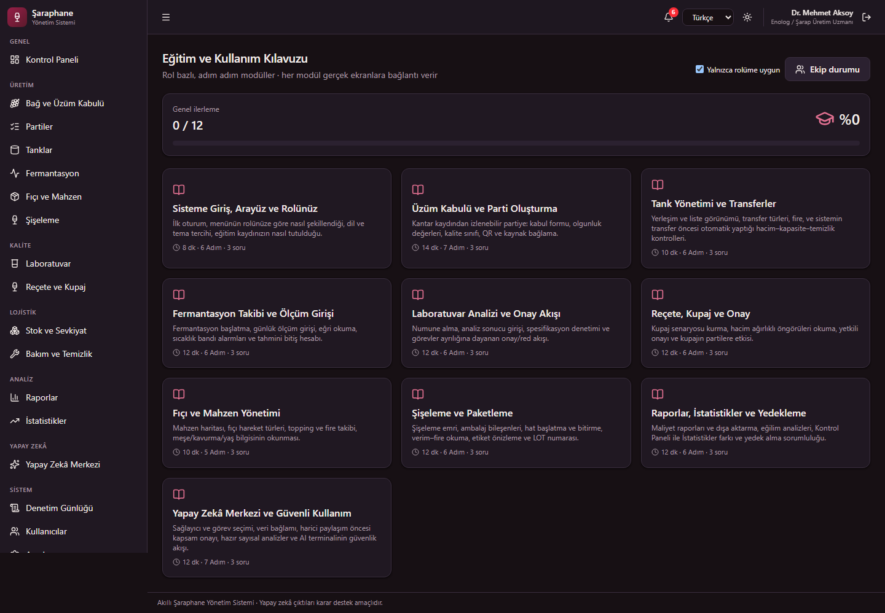

Modül içeriği adım adım ilerler ve ilgili ekrana doğrudan bağlantı verir:

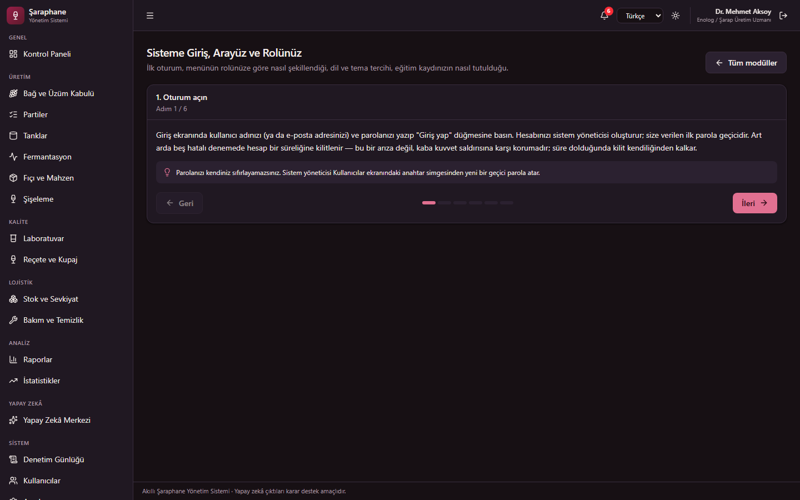

---

## Yedekleme

### Uygulama içinden (önerilen)

**Yedekleme** ekranından tek tıkla yedek alınır, listelenir, indirilir ve eskiler
temizlenir. Kurulu (MSI) sürümde PowerShell betiği bulunmadığı için tek yol budur.

| Yetki | Kim | Ne yapabilir |
|---|---|---|
| `backup:manage` | Sistem yöneticisi, İşletme yöneticisi | Yedek al, listele, sil |
| `backup:download` | **Yalnızca sistem yöneticisi** | Yedek dosyasını makine dışına çıkar |

> Yedek dosyası **tüm veritabanının kopyasıdır**: parola özetleri, şifreli API
> anahtarları ve denetim günlüğü içerir. Bu yüzden indirme ayrı bir yetkidir ve
> her indirme denetim günlüğüne yazılır.

### Komut satırından

```powershell
powershell -ExecutionPolicy Bypass -File scripts\yedekle.ps1
powershell -ExecutionPolicy Bypass -File scripts\yedekle.ps1 -YuklemeleriDahilEt -SaklananGun 60
```

- SQLite yedeği `VACUUM INTO` ile alınır — dosya kopyalamak WAL kipinde **bozuk
  yedek** üretir; bu yöntem henüz ana dosyaya işlenmemiş işlemleri de kapsar
- PostgreSQL için `pg_dump` kullanılır
- Yedekler veri kökündeki `data\backups` altına yazılır (kurulu sürümde
  `%LOCALAPPDATA%\Saraphane\data\backups`)

### Geri yükleme

Geri yükleme **uygulama içinden yapılamaz** ve bu bilinçli bir karardır:
kullanıcının hazırladığı bir veritabanını yüklemek doğrudan ayrıcalık yükseltme
yoludur — saldırgan kendisini yönetici yapan bir dosya yükleyip sisteme sahip
olur. Yordam:

1. Uygulamayı **kapatın** (WAL dosyaları serbest kalmalıdır)
2. Mevcut `data\winery.db`, `winery.db-wal`, `winery.db-shm` dosyalarını yedekleyin
3. Yedek dosyasını `winery.db` adıyla kopyalayın, `-wal`/`-shm` dosyalarını **silin**
4. Uygulamayı açın; şema gerekiyorsa Alembic otomatik yükseltir

> Yedekleri düzenli olarak **farklı bir fiziksel ortama** kopyalayın; aynı
> diskteki yedek, disk arızasında birlikte kaybolur.

---

## GitHub iş akışı

```powershell
git checkout -b ozellik/yeni-modul
# … değişiklikler …
powershell -File scripts\testler.ps1     # commit öncesi kalite kapıları
git add -A
git commit -m "Yeni modül: …"
git checkout main
git merge ozellik/yeni-modul
```

Depoya gönderim öncesi kontrol listesi:

- [ ] `scripts\testler.ps1` tamamen geçiyor
- [ ] `.env` **commit edilmemiş** (`git status` ile doğrulayın)
- [ ] Gizli bilgi taraması temiz (`git log -p | Select-String "sk-ant-|nvapi-|password="`)
- [ ] Veritabanı, günlük, yüklenen belge ve model dosyaları depoda yok

---

## Ekran görüntüleri

Görseller demo veriyle üretilmiştir; gerçek üretim verisi içermez. Yeniden üretmek için
backend ve frontend çalışırken:

```bash
cd frontend; npm run gorseller
```

### Kontrol paneli

Aktif parti, hacim, tank doluluk, açık uyarı göstergeleri; devam eden fermantasyonların
tahmini bitiş hesabı; üzüm kabul grafiği ve yapay zekâ risk önerileri.

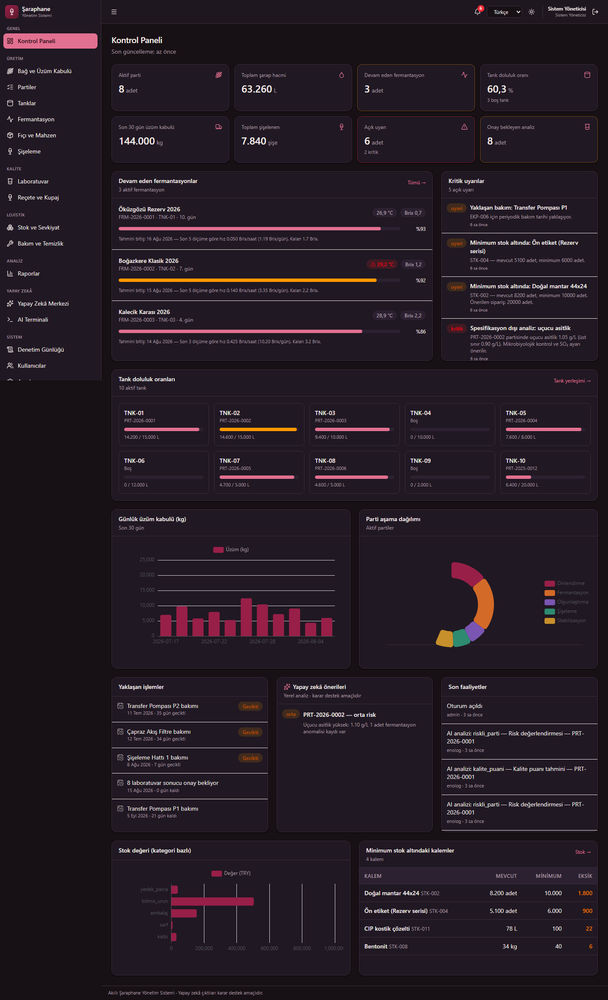

### Fermantasyon takibi

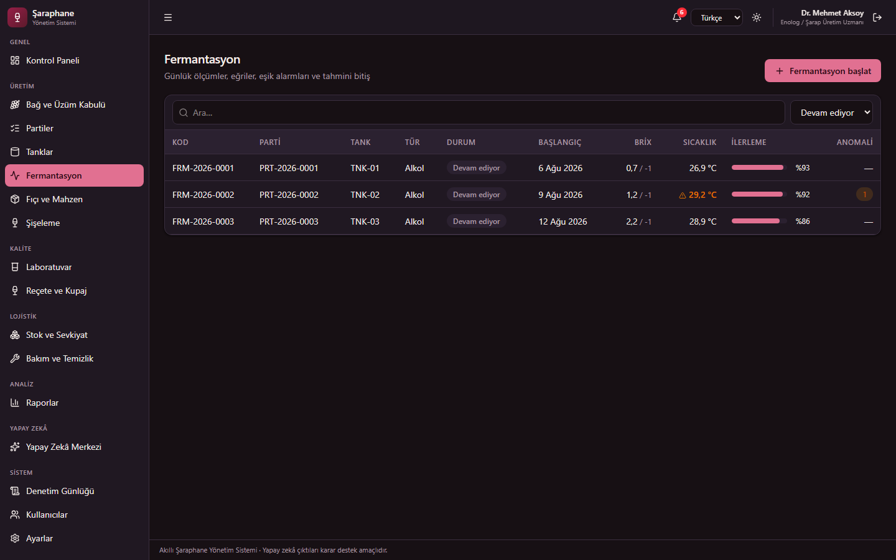

### İzlenebilirlik çizgesi

Bir partinin bağdan şişeye tüm zinciri; yön (geriye / ileriye / tam) seçilebilir.

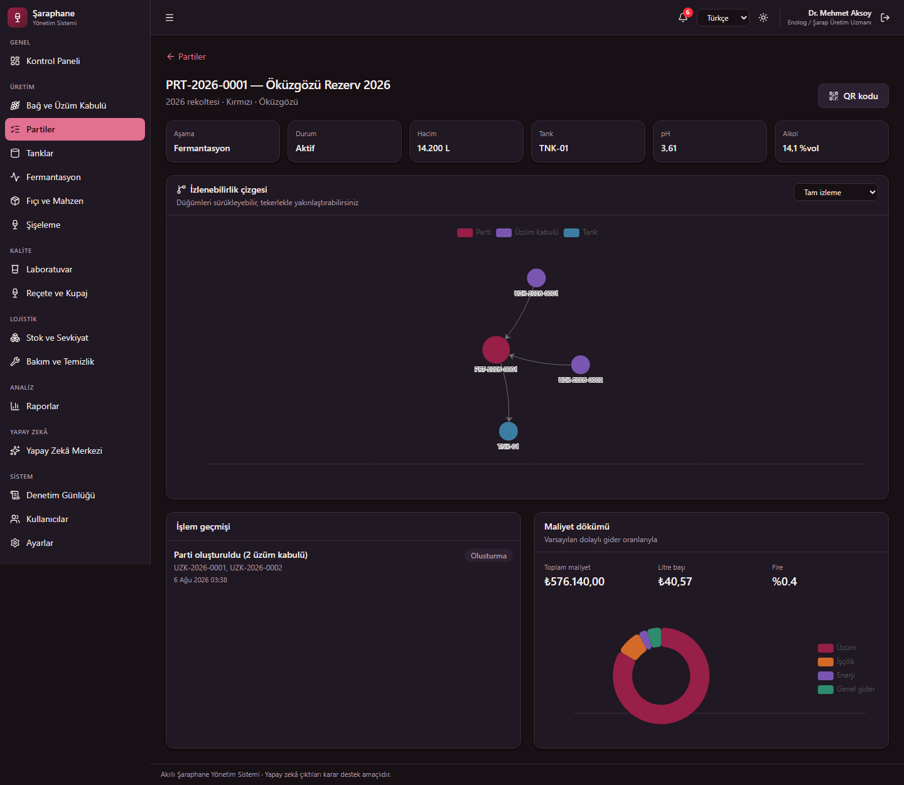

### Tank yerleşimi ve mahzen

| Tanklar | Fıçı ve mahzen |
|---|---|
| 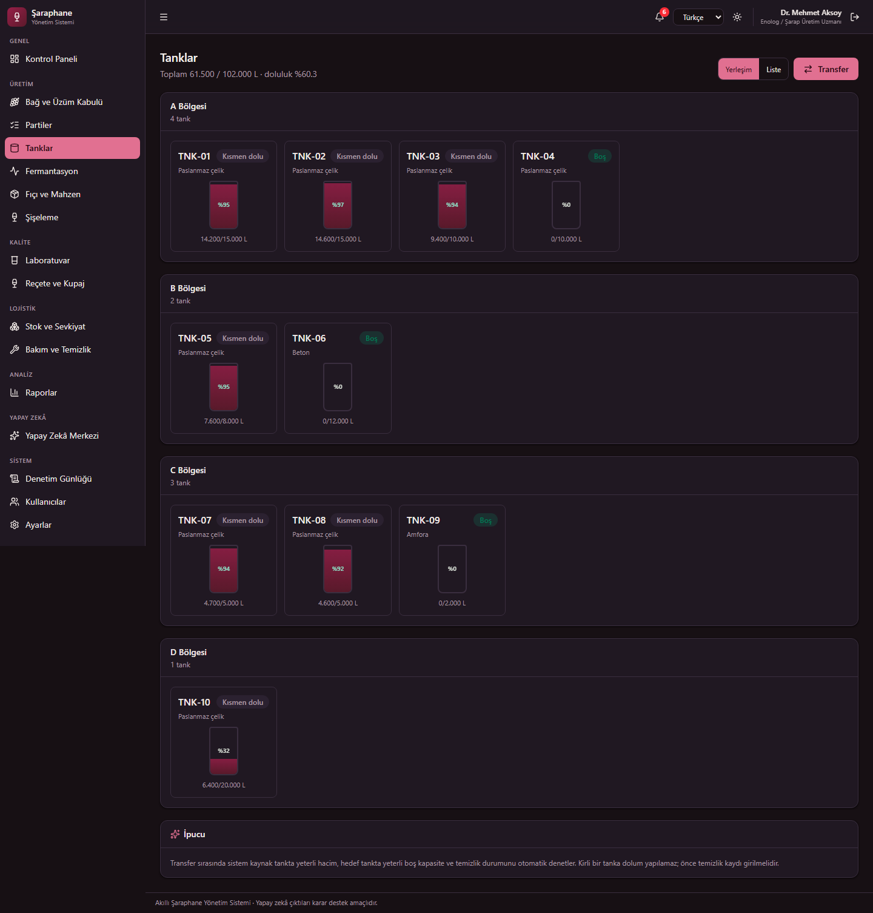 | 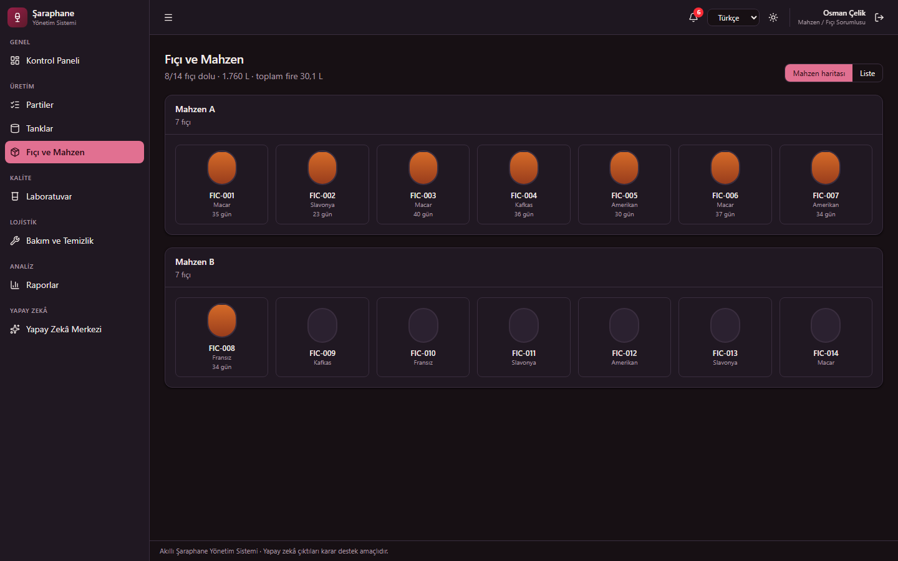 |

### İstatistikler

Kontrol Paneli **anlık durumu** gösterir; İstatistikler **işletme nasıl gidiyor**
sorusunu yanıtlar: parsel bazlı verim (kg/dekar), üzümden şişeye kayıp zinciri,
fermantasyon süreleri, spesifikasyon dışı analiz oranı, şişeleme verimi, fıçı
kullanımı, stok devri ve bakım duruşları.

Her sekme **kendi yetkisiyle** korunur: tek bir uç nokta kullanılsaydı
`report:read` taşıyan ama `cost:read`/`lab:read` taşımayan roller (satış, depo)
maliyet ve laboratuvar verisini görürdü.

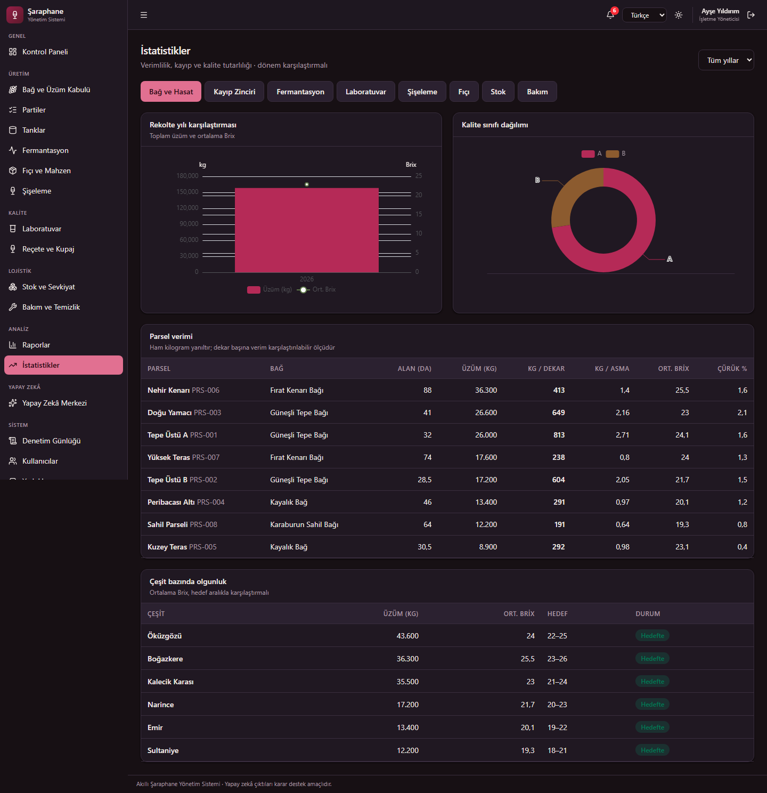

### Yedekleme

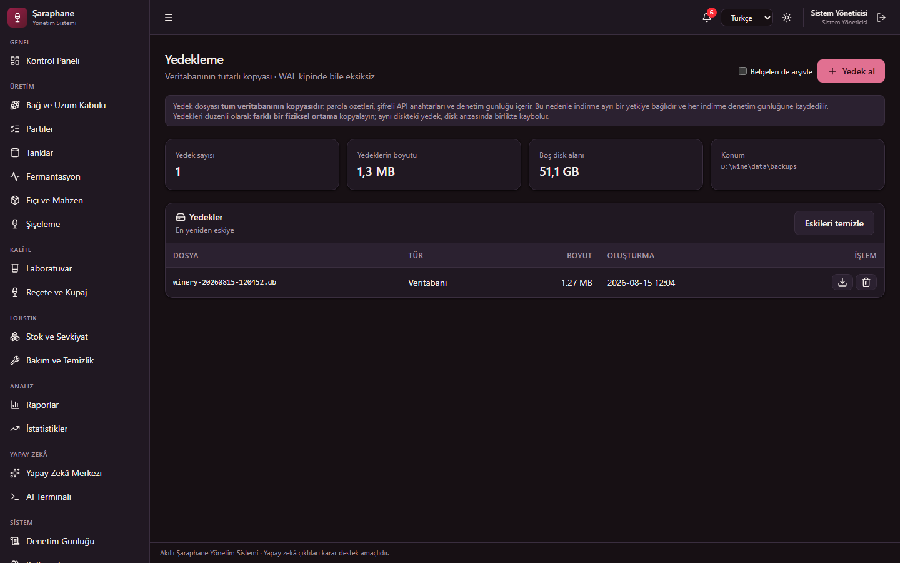

### Yapay Zekâ Çalışma Merkezi

Sağlayıcı ve görev seçimi, veri bağlamı, harici paylaşım öncesi kapsam onayı.

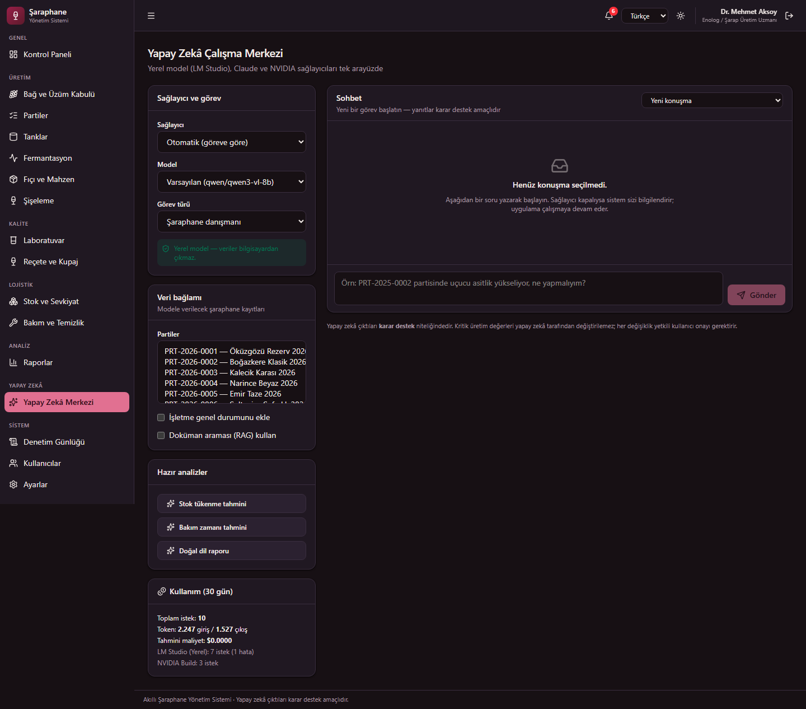

### AI Terminali (plan → onay → diff)

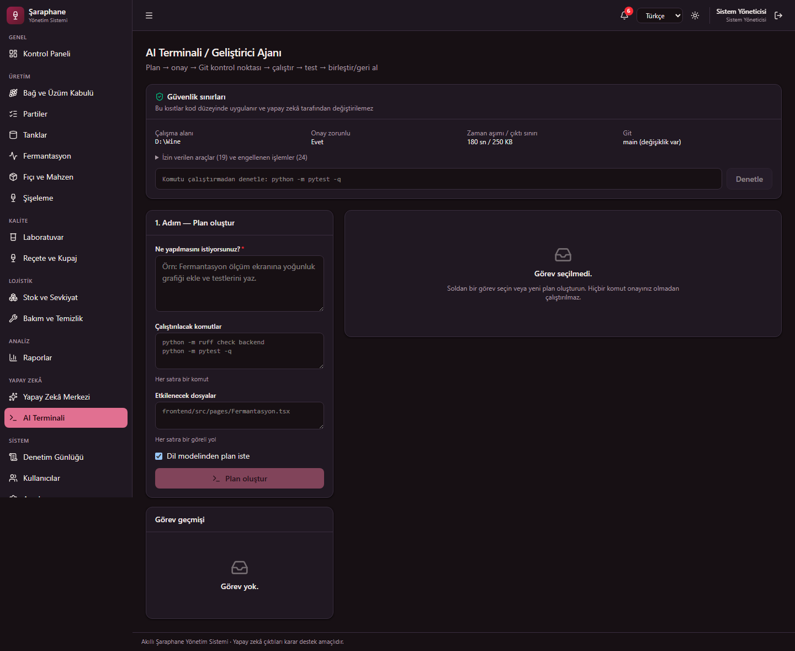

### Sağlayıcı ayarları

API anahtarları şifrelenerek saklanır ve arayüzde yalnızca maskeli gösterilir.
Aşağıdaki görselde maskeli değerler ayrıca yer tutucuyla değiştirilmiştir.

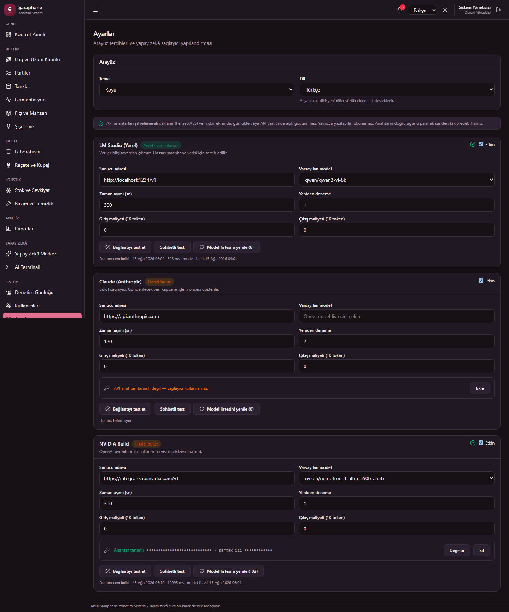

### İngilizce arayüz

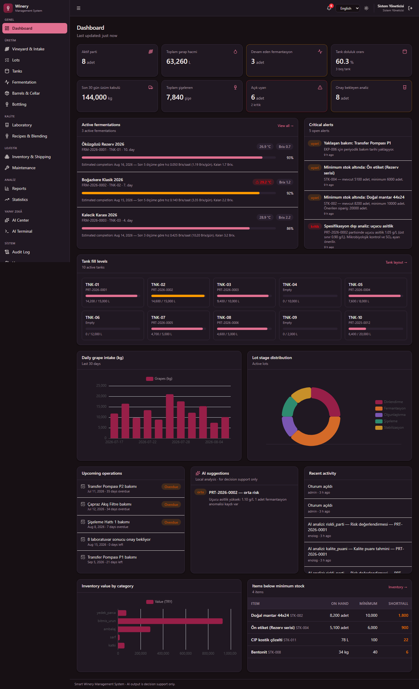

### Giriş

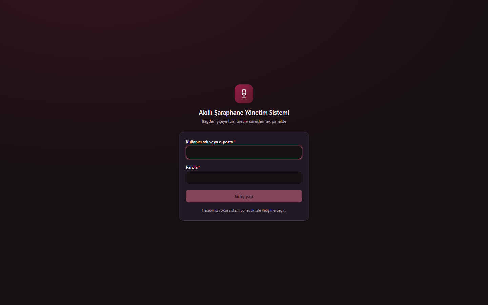

---

## Mimari

Ayrıntılar: [ARCHITECTURE.md](ARCHITECTURE.md)

```
<proje-kok-dizini>
├─ backend\          FastAPI + SQLAlchemy 2 (async) + Alembic
│  ├─ app\core\      yapılandırma, güvenlik, yetkilendirme, günlükleme, denetim
│  ├─ app\models\    49 tablo — SQLAlchemy 2 deklaratif modeller
│  ├─ app\schemas\   Pydantic v2 giriş/çıkış şemaları
│  ├─ app\api\       165 uç nokta yolu / 240 işlem (v1)
│  ├─ app\services\  iş mantığı: izlenebilirlik, stok, maliyet, uyarı, dışa aktarma
│  ├─ app\services\ai\  AIProvider soyutlaması ve sağlayıcılar
│  ├─ app\agent\     AI terminali güvenlik çekirdeği (sandbox, executor, git)
│  └─ alembic\       veritabanı göçleri
├─ frontend\         React 19 + TypeScript + Vite + Tailwind v4 + ECharts
├─ tests\            536 test (birim + API + güvenlik)
├─ scripts\          kurulum, başlatma, test, yedekleme, demo veri, AI değerlendirme
├─ docs\             mimari, güvenlik, bilinen sınırlar, model değerlendirmeleri
├─ data\             veritabanı, yüklemeler, yedekler (Git'e girmez)
└─ logs\             uygulama günlükleri (Git'e girmez)
```

### Teknoloji seçimleri ve gerekçeleri

| Karar | Gerekçe |
|---|---|
| **asyncpg** (psycopg yerine) | psycopg2/psycopg3 **LGPL** lisanslıdır; proje ileride kapalı kaynak ticari ürüne dönüşebileceği için Apache-2.0 lisanslı asyncpg tercih edildi |
| **Argon2id** | OWASP'ın parola karması için birinci önerisi |
| **Kendi hız sınırlayıcımız** | Ek bağımlılık ve lisans yüzeyi eklemeden ihtiyacı karşılıyor |
| **Kendi i18n katmanımız** | Bu ölçekte harici i18n kütüphanesi gereksiz bağımlılık |
| **ECharts** (Apache-2.0) | Ticari kullanıma uygun, zengin grafik desteği |
| **Sayısal AI çekirdeği** | Dil modeli kapalıyken de özelliklerin çalışması ve sonuçların test edilebilir olması için |

---

## Lisans

⚠️ **Bu projeye henüz bir lisans atanmamıştır.** Bkz.
This project is released under the [MIT License](LICENSE). It may be used,
modified, distributed and sublicensed subject to the MIT notice and applicable
law.

> Lisans dosyası eklenene kadar **tüm haklar saklıdır**: kopyalama, değiştirme ve
> yeniden dağıtım için izin verilmemiştir. Bu bir ihmal değil, bilinçli olarak
> ertelenmiş bir karardır.

Proje ileride ticari ve kapalı kaynak bir ürüne dönüştürülebileceğinden, lisans kararı
bilinçli olarak **proje sahibine** bırakılmıştır. Lisans dosyası eklenene kadar tüm haklar
saklıdır.

Kullanılan **tüm üçüncü taraf bağımlılıklar** ticari/kapalı kaynak kullanıma uygun
lisanslara (MIT, BSD, Apache-2.0, ISC, Unlicense) sahiptir. GPL/AGPL/LGPL lisanslı hiçbir
bağımlılık kullanılmamıştır. Tam liste ve gerekçeler:
[THIRD_PARTY_LICENSES.md](THIRD_PARTY_LICENSES.md)
